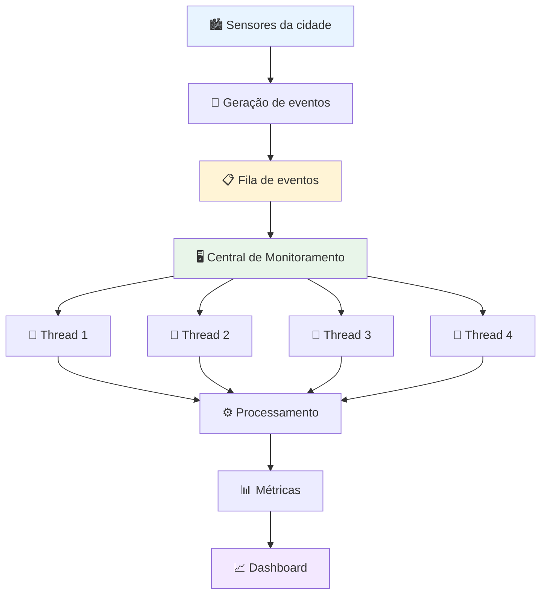

# Smart City Monitor 🏙️

Projeto prático da disciplina de Sistemas Operacionais.

## 📌 Sobre o projeto

O **Smart City Monitor** é uma aplicação que simula uma central de monitoramento de uma cidade inteligente. A cidade possui diferentes fontes de informação, como sensores de trânsito, clima, consumo de energia e qualidade do ar, que geram notificações continuamente.

O foco do projeto não está apenas no monitoramento dos sensores, mas na análise de **como uma Central de Monitoramento se comporta ao receber diferentes volumes de notificações e ao utilizar diferentes quantidades de Threads para processá-las**.

A aplicação permitirá aumentar progressivamente a frequência de geração de eventos até que uma única Thread da Central não consiga mais acompanhar a demanda. Em seguida, novas Threads serão adicionadas para verificar se o sistema consegue recuperar sua capacidade de processamento.

Dessa forma, será possível observar e analisar experimentalmente os efeitos do uso de múltiplas Threads sobre o desempenho da aplicação.

---

## 🎯 Objetivos

* Simular uma Central de Monitoramento de uma cidade inteligente;
* Gerar notificações provenientes de diferentes tipos de sensores;
* Processar as notificações de forma concorrente;
* Analisar o comportamento da aplicação conforme a taxa de eventos aumenta;
* Identificar o ponto em que uma única Thread não consegue acompanhar a demanda;
* Comparar o desempenho utilizando 1, 2, 3 e 4 Threads;
* Medir métricas como tempo de resposta, quantidade de eventos processados e eventos pendentes;
* Apresentar os resultados de forma visual.

---

## 🏗️ Funcionamento

Os sensores atuam como **fontes de eventos**, gerando notificações em diferentes frequências.

Os eventos são enviados para uma **fila compartilhada**, que funciona como ponto de comunicação entre os sensores e a Central.

A Central possui uma ou mais Threads responsáveis por retirar os eventos da fila e processá-los.

O número de Threads poderá ser alterado durante os experimentos para analisar como isso afeta a capacidade de processamento do sistema.

### Fluxo da aplicação



> **Observação:** durante os experimentos, apenas uma parte das Threads poderá estar ativa. O sistema permitirá comparar o comportamento com 1, 2, 3 e 4 Threads.

---

## 🚦 Fontes de eventos

A aplicação poderá simular diferentes tipos de sensores:

* 🚦 **Trânsito** — congestionamentos, acidentes e alterações no fluxo de veículos;
* 🌧️ **Clima** — temperatura, chuva e umidade;
* ⚡ **Energia** — consumo de energia em diferentes regiões;
* 🌫️ **Qualidade do ar** — índices de qualidade do ar e possíveis situações críticas.

Os sensores não serão responsáveis pelo processamento das informações. Seu papel será principalmente **gerar eventos e enviá-los para a fila da Central**.

---

## 🧵 Uso de Threads

O principal conceito estudado no projeto será a utilização de **múltiplas Threads para o processamento concorrente dos eventos**.

Inicialmente, a Central poderá funcionar com apenas uma Thread:

```text
                Fila
                  │
                  ▼
            ┌──────────┐
            │ Thread 1 │
            └────┬─────┘
                 │
                 ▼
             Processar
```

Conforme a quantidade de eventos aumenta, a Thread poderá não conseguir processar todos os eventos na mesma velocidade em que eles são gerados.

Nesse momento, novas Threads serão adicionadas:

```text
                Fila
                  │
        ┌─────────┼─────────┐
        ▼         ▼         ▼
   Thread 1   Thread 2   Thread 3
        │         │         │
        └─────────┼─────────┘
                  ▼
              Resultados
```

O objetivo é observar se o aumento do número de Threads permite que a Central processe uma quantidade maior de eventos e reduza o tempo de resposta.

---

## 📈 Experimentos

Os experimentos serão realizados aumentando progressivamente a frequência de geração de eventos.

### Experimento 1 — Baixa carga

A aplicação começa com uma frequência baixa de eventos e uma única Thread.

O objetivo é estabelecer um comportamento inicial do sistema.

### Experimento 2 — Aumento da carga

A frequência de eventos será aumentada gradualmente enquanto a Central continua utilizando apenas uma Thread.

Será observado o momento em que a capacidade de processamento da Central começa a ser comprometida.

### Experimento 3 — Aumento do número de Threads

Após identificar uma situação de sobrecarga, serão adicionadas novas Threads:

```text
1 Thread → 2 Threads → 3 Threads → 4 Threads
```

Os resultados serão comparados mantendo condições semelhantes de carga.

### Experimento 4 — Comparação dos resultados

Os dados coletados serão utilizados para comparar o desempenho das diferentes configurações.

Exemplo de tabela:

| Threads | Eventos gerados | Eventos processados | Eventos pendentes | Tempo médio |
| ------: | --------------: | ------------------: | ----------------: | ----------: |
|       1 |               — |                   — |                 — |           — |
|       2 |               — |                   — |                 — |           — |
|       3 |               — |                   — |                 — |           — |
|       4 |               — |                   — |                 — |           — |

Os valores serão preenchidos a partir dos resultados obtidos durante os testes.

---

## 📊 Métricas

Durante os experimentos, serão coletadas métricas para permitir uma análise quantitativa do comportamento do sistema.

Entre elas:

* **Tempo de resposta:** tempo entre a geração de um evento e seu processamento pela Central;
* **Eventos recebidos:** quantidade de eventos gerados/recebidos pela Central;
* **Eventos processados:** quantidade de eventos efetivamente processados;
* **Eventos pendentes:** eventos que permanecem aguardando processamento na fila;
* **Taxa de geração:** quantidade de eventos gerados por segundo;
* **Taxa de processamento:** quantidade de eventos processados por segundo.

Os resultados serão apresentados visualmente por meio de um dashboard e gráficos.

---

## 🖥️ Dashboard

A aplicação terá uma interface visual para acompanhar o experimento em tempo real.

Entre as informações apresentadas estarão:

```text
┌─────────────────────────────────────────┐
│        SMART CITY MONITOR               │
├─────────────────────────────────────────┤
│                                         │
│ Threads ativas:          2              │
│ Eventos recebidos:       8.421          │
│ Eventos processados:     7.982          │
│ Eventos pendentes:         439          │
│                                         │
│ Taxa de entrada:          50 eventos/s  │
│ Taxa de processamento:    46 eventos/s  │
│                                         │
│ Tempo médio:              342 ms        │
│                                         │
└─────────────────────────────────────────┘
```

Os valores acima são apenas ilustrativos. Os dados reais serão obtidos durante os experimentos.

---

## 🛠️ Tecnologias

* Java
* Maven
* Threads
* [Tecnologia da interface — a definir]

---

## 📂 Estrutura do projeto

A estrutura inicial planejada é:

```text
src/
└── main/
    └── java/
        └── br/
            └── smartcity/
                └── monitor/
                    ├── Main.java
                    │
                    ├── central/
                    │   ├── CentralMonitoramento.java
                    │   └── ProcessadorEventos.java
                    │
                    ├── sensor/
                    │   ├── Sensor.java
                    │   ├── SensorTransito.java
                    │   ├── SensorClima.java
                    │   ├── SensorEnergia.java
                    │   └── SensorQualidadeAr.java
                    │
                    ├── model/
                    │   ├── Evento.java
                    │   └── ResultadoProcessamento.java
                    │
                    └── metrics/
                        └── Metricas.java
```

---

## 🚧 Status

**Em desenvolvimento**

* [x] Definição do tema
* [x] Definição do escopo
* [x] Definição do fluxo da aplicação
* [ ] Implementação da fila de eventos
* [ ] Implementação dos sensores
* [ ] Implementação da Central
* [ ] Implementação das Threads de processamento
* [ ] Implementação das métricas
* [ ] Implementação do dashboard
* [ ] Execução dos experimentos
* [ ] Análise dos resultados
* [ ] Documentação final
