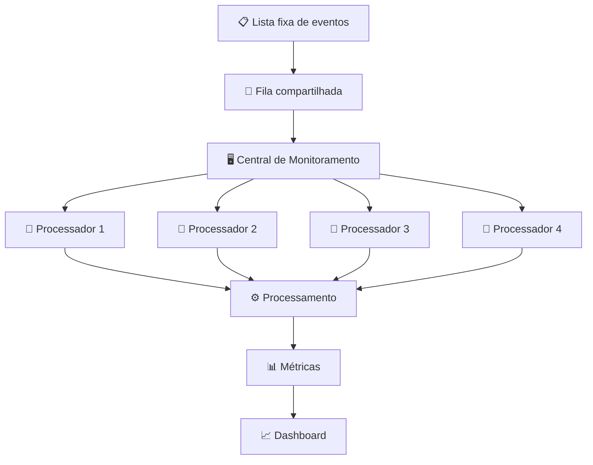

# Smart City Monitor 🏙️

Projeto prático da disciplina de **Sistemas Operacionais**.

## 📌 Sobre o projeto

O **Smart City Monitor** é uma aplicação em Java que simula uma **Central de Monitoramento de uma cidade inteligente**.

O projeto utiliza uma lista fixa de eventos, representando informações provenientes de diferentes tipos de sensores:

- 🚦 Trânsito
- 🌧️ Clima
- ⚡ Energia
- 🌫️ Qualidade do ar

O foco principal do projeto é analisar o comportamento da **Central de Monitoramento ao processar uma mesma carga de eventos utilizando diferentes quantidades de Threads**.

Os eventos são colocados em uma fila compartilhada e as Threads da Central atuam como **consumidoras**, retirando os eventos da fila e realizando seu processamento de forma concorrente.

Dessa forma, é possível comparar configurações com **1, 2, 3 e 4 Threads**, observando métricas como vazão, tempo total, tempo médio de resposta e quantidade de eventos processados ou pendentes.

---

## 🎯 Objetivos

- Simular uma Central de Monitoramento de uma cidade inteligente;
- Representar diferentes tipos de eventos provenientes de sensores;
- Utilizar uma fila compartilhada para armazenar os eventos;
- Processar os eventos de forma concorrente;
- Comparar o processamento utilizando 1, 2, 3 e 4 Threads;
- Observar os efeitos da concorrência sobre o tempo de processamento;
- Medir a quantidade de eventos processados e pendentes;
- Calcular a taxa de processamento (eventos por segundo);
- Acompanhar o experimento por meio de um dashboard;
- Comparar os resultados de diferentes configurações.

---

## 🏗️ Funcionamento

A aplicação trabalha com uma **lista fixa de eventos**. Esses eventos são inseridos em uma fila antes do início do processamento.

A Central de Monitoramento cria a quantidade de Threads definida para o experimento. Cada Thread retira eventos da fila e os processa de forma independente.

Não existe uma Thread dedicada à geração contínua dos eventos durante o experimento. O objetivo é manter a **carga de trabalho fixa** e variar a quantidade de Threads da Central.

### Fluxo da aplicação



Durante cada experimento, apenas a quantidade configurada de Threads é criada. Assim, a mesma carga de eventos pode ser processada com diferentes níveis de concorrência.

---

## 🚦 Tipos de eventos

Os eventos utilizados na simulação representam quatro categorias:

- 🚦 **Trânsito** — congestionamentos, acidentes e alterações no fluxo de veículos;
- 🌧️ **Clima** — temperatura, chuva e umidade;
- ⚡ **Energia** — consumo de energia em diferentes regiões;
- 🌫️ **Qualidade do ar** — índices de qualidade do ar e situações críticas.

Os sensores representam as fontes conceituais desses eventos. O processamento é realizado exclusivamente pelas Threads da Central.

---

## 🧵 Uso de Threads

O principal conceito estudado no projeto é o **processamento concorrente utilizando múltiplas Threads**.

Com uma única Thread:

```text
             Fila
               │
               ▼
        ┌─────────────┐
        │   Thread 1  │
        └──────┬──────┘
               │
               ▼
          Processar
```

Com várias Threads:

```text
                 Fila
                   │
          ┌────────┼────────┐
          ▼        ▼        ▼
      Thread 1  Thread 2  Thread 3
          │        │        │
          └────────┼────────┘
                   ▼
              Processar
```

O sistema suporta de **1 a 4 Threads consumidoras**.

Como as Threads compartilham a mesma fila, é necessário utilizar mecanismos de concorrência adequados para evitar perda ou processamento duplicado de eventos.

---

## 📈 Experimentos

O experimento utiliza a **mesma lista de eventos** e altera a quantidade de Threads da Central.

As configurações podem ser executadas com:

```text
1 Thread → 2 Threads → 3 Threads → 4 Threads
```

Para cada configuração, são coletadas informações sobre o processamento.

### Comparação

Exemplo de tabela de resultados:

| Threads | Eventos gerados | Eventos processados | Pendentes | Taxa de processamento | Tempo médio |
|--------:|----------------:|--------------------:|---------:|----------------------:|------------:|
| 1       | —               | —                   | —        | —                     | —           |
| 2       | —               | —                   | —        | —                     | —           |
| 3       | —               | —                   | —        | —                     | —           |
| 4       | —               | —                   | —        | —                     | —           |

Os valores são preenchidos automaticamente a partir das execuções realizadas pela aplicação.

---

## 📊 Métricas

Durante os experimentos, a aplicação acompanha diferentes métricas:

- **Eventos gerados:** quantidade total de eventos colocados na fila;
- **Eventos processados:** quantidade de eventos efetivamente processados pela Central;
- **Eventos pendentes:** quantidade de eventos que ainda permanecem na fila;
- **Taxa de processamento:** quantidade média de eventos processados por segundo;
- **Tempo médio de resposta:** tempo médio entre a entrada do evento e sua conclusão;
- **Tempo total:** duração total do processamento do experimento;
- **Eventos por tipo:** quantidade de eventos processados de Trânsito, Clima, Energia e Qualidade do ar.

Essas métricas permitem observar como a quantidade de Threads influencia o processamento da carga.

---

## 🖥️ Dashboard

A aplicação possui uma interface gráfica desenvolvida com **JavaFX**.

Na aba **Monitoramento**, é possível:

- selecionar a quantidade de Threads da Central, de 1 a 4;
- configurar o tempo artificial de processamento de cada evento;
- iniciar o experimento;
- acompanhar os eventos processados;
- visualizar eventos pendentes;
- acompanhar a taxa de processamento;
- visualizar o tempo médio e o tempo total;
- acompanhar os eventos processados por tipo;
- visualizar os eventos em uma tabela;
- acompanhar a evolução da fila em um gráfico;
- parar ou resetar o experimento.

A aba **Resultados** mantém os experimentos finalizados e permite comparar as configurações utilizadas, incluindo gráficos de processamento e latência.

---

## 🛠️ Tecnologias

- **Java**
- **JavaFX**
- **JavaFX Charts**
- **Maven**
- **Java Threads**
- **BlockingQueue**
- **CSS**
- **JUnit**

---

## ▶️ Como executar

### Pré-requisitos

É necessário ter instalado:

- JDK;
- Maven.

### Executar o dashboard

Abra um terminal na pasta raiz do projeto e execute:

```bash
mvn clean javafx:run
```

O comando inicia a aplicação JavaFX.

### Executar os testes

Para executar os testes automatizados:

```bash
mvn clean test
```

Os testes verificam principalmente o comportamento da Central de Monitoramento e do fluxo de execução do experimento.

---

## 📂 Estrutura do projeto

```text
Smart-City-Monitor/
├── pom.xml
├── src/
│   ├── main/
│   │   ├── java/
│   │   │   └── br/
│   │   │       └── smartcity/
│   │   │           └── monitor/
│   │   │               ├── central/
│   │   │               │   ├── CentralMonitoramento.java
│   │   │               │   └── ProcessadorEventos.java
│   │   │               │
│   │   │               ├── config/
│   │   │               │   └── ConfiguracaoExperimento.java
│   │   │               │
│   │   │               ├── metrics/
│   │   │               │   └── Metricas.java
│   │   │               │
│   │   │               ├── model/
│   │   │               │   ├── Evento.java
│   │   │               │   ├── ResultadoProcessamento.java
│   │   │               │   └── TipoEvento.java
│   │   │               │
│   │   │               ├── sensor/
│   │   │               │   ├── ListaEventos.java
│   │   │               │   ├── Sensor.java
│   │   │               │   ├── SensorClima.java
│   │   │               │   ├── SensorEnergia.java
│   │   │               │   ├── SensorQualidadeAr.java
│   │   │               │   └── SensorTransito.java
│   │   │               │
│   │   │               └── ui/
│   │   │                   ├── DashboardController.java
│   │   │                   ├── DashboardSnapshot.java
│   │   │                   ├── ExperimentoResultado.java
│   │   │                   ├── MonitoramentoView.java
│   │   │                   ├── ResultadosView.java
│   │   │                   └── SmartCityApplication.java
│   │   │
│   │   └── resources/
│   │       └── br/
│   │           └── smartcity/
│   │               └── monitor/
│   │                   └── ui/
│   │                       └── dashboard.css
│   │
│   └── test/
│       └── java/
│           └── br/
│               └── smartcity/
│                   └── monitor/
│                       ├── central/
│                       │   └── CentralMonitoramentoTest.java
│                       └── ui/
│                           └── DashboardControllerTest.java
│
└── README.md
```

---

## 📌 Principais componentes

### `CentralMonitoramento`

Responsável por controlar as Threads que realizam o processamento dos eventos.

### `ProcessadorEventos`

Representa uma Thread consumidora. Cada processador retira eventos da fila e executa seu processamento.

### `ListaEventos`

Fornece a lista fixa de eventos utilizada nos experimentos.

### `Metricas`

Mantém os contadores e cálculos relacionados ao desempenho do processamento.

### `DashboardController`

Faz a ligação entre a execução do experimento, as métricas e a interface gráfica.

### `MonitoramentoView`

Exibe o acompanhamento do experimento em tempo real.

### `ResultadosView`

Apresenta os experimentos finalizados e permite comparar seus resultados.

---

## 🚧 Status

**Em desenvolvimento**

- [x] Definição do tema
- [x] Definição do escopo
- [x] Definição da arquitetura do experimento
- [x] Implementação da fila de eventos
- [x] Implementação da lista fixa de eventos
- [x] Implementação da Central
- [x] Implementação das Threads de processamento
- [x] Implementação das métricas
- [x] Contagem de eventos por tipo
- [x] Implementação do dashboard
- [x] Implementação da tela de resultados
- [x] Testes automatizados
- [ ] Execução e comparação dos experimentos
- [ ] Análise dos resultados
- [ ] Documentação final

---

## 👥 Projeto acadêmico

Projeto desenvolvido para a disciplina de **Sistemas Operacionais**, com foco no estudo de **Threads, concorrência, sincronização e desempenho de processamento**.
